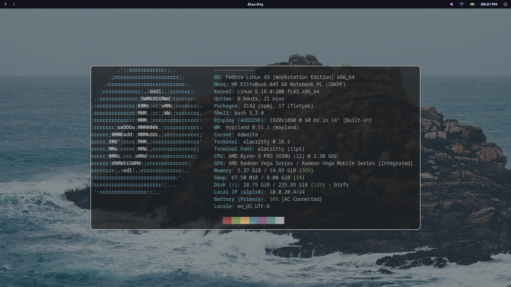
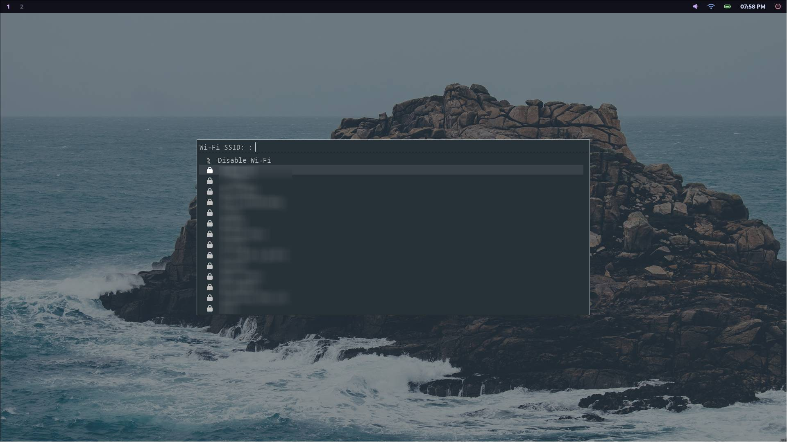
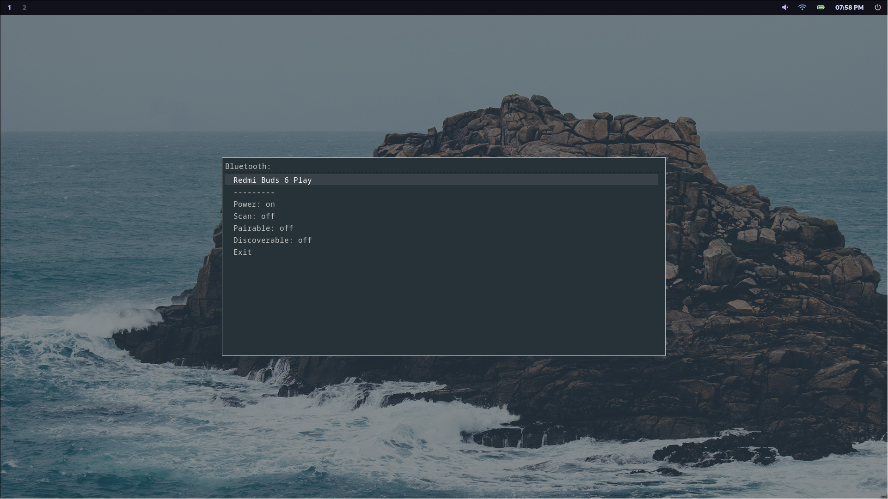
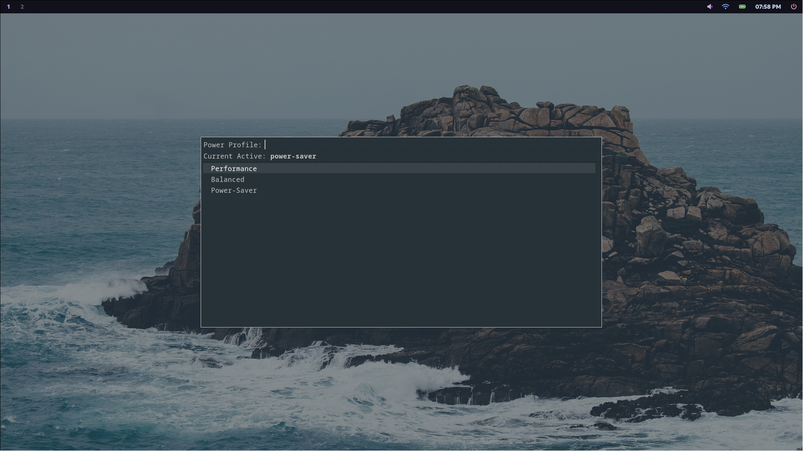

❄️ Hyprland Dotfiles

Optimized for Fedora 43

A minimalist, high-performance Wayland environment. This setup focuses on a clean workflow using the Hyprland ecosystem and GPU-accelerated tools.
🛠️ Core Components

    Window Manager: Hyprland

    Bar: Waybar

    Terminal: Alacritty

    Launcher: Rofi (Wayland-fork)

    Wallpaper: Hyprpaper

    Security: Hyprlock & Hypridle

🚀 Installation
1. Download Dependencies

Run the command corresponding to your distribution:

Fedora
Bash

    sudo dnf install hyprland hypridle hyprlock hyprpaper rofi-wayland waybar alacritty nautilus powerprofilectl

Arch Linux
Bash

    sudo pacman -S hyprland hypridle hyprlock hyprpaper rofi-wayland waybar alacritty nautilus powerprofilectl

Debian/Ubuntu
Bash

    sudo apt install hyprland hypridle hyprlock hyprpaper rofi waybar alacritty nautilus powerprofilectl

2. Apply Configuration

Clone this repository and move the folders into your .config directory.
Bash

# Clone the repository
    git clone https://github.com/abdulrahmaninfra/dotfiles.git

# Navigate to the folder
    cd dotfiles

# Copy configurations to your home directory
    cp -r .config/* ~/.config/

✨ Key Features

    Fast & Fluid: Zero bloat, leveraging Fedora 43's latest Wayland improvements.

    Automated Power Management: Integrated hypridle settings to save battery/power.

    Modern Lockscreen: Custom hyprlock layout with clock and battery status.

    Unified Styling: Consistent colors across Waybar, Rofi, and the terminal.

⌨️ Quick Start Bindings

    Super + Enter — Open Alacritty

    Super + D — App Launcher (Rofi)

    Super + Q — Close Window

    Super + i — Toggle Fullscreen\
Screenshots

Desktop     

Rofi

Wifi

Bluetooth

Power Profiles

